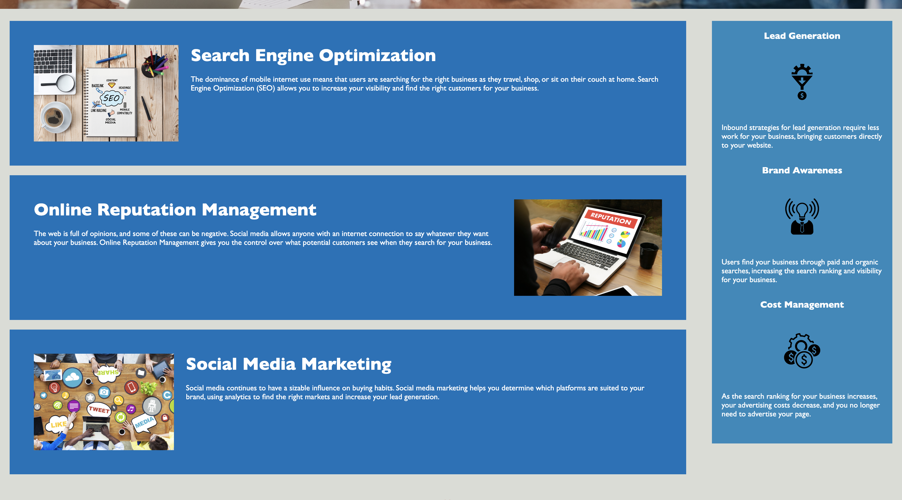

# horiseon-refactor

## Description

This ticket includes code that I refactored for the Horiseon website to make it more accessible.

The code now meets accessible standards with the below Acceptance Criteria:
* WHEN I view the source code
* THEN I find semantic HTML elements
* WHEN I view the structure of the HTML elements
* THEN I find that the elements follow a logical structure independent of styling and positioning
* WHEN I view the image elements
* THEN I find accessible alt attributes
* WHEN I view the heading attributes
* THEN they fall in sequential order
* WHEN I view the title element
* THEN I find a concise, descriptive title

## Usage

This website can be used to view Horiseon's marketing services listed below. 

Deployed website is here: https://janealexadams.github.io/horiseon-refactor/

## Credits

Existing code was used from the Horiseon website, and is in the indiex.html file. 